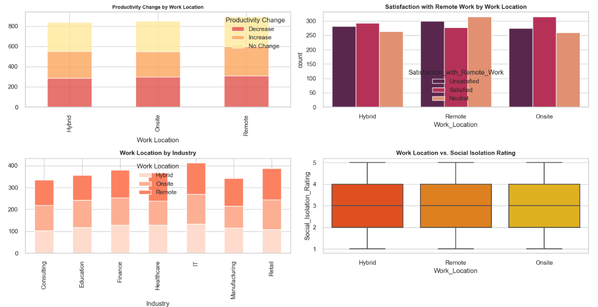

# Capstone Project on Data Analysis and Machine Learning using Pyhton

### Remote Work and Mental Health Analysis and Predicting Mental Health Condition

[Link to dataset][(https://www.kaggle.com/datasets/waqi786/remote-work-and-mental-health/data)]

#### Description of dataset
This dataset has 5,000 entries with 20 columns covering demographics, professional details, mental health, lifestyle, and productivity. Key features include Age, Gender, Job_Role, Stress_Level, and Mental_Health_Condition . It contains both numerical and categorical data, with missing values in Mental_Health_Condition and Physical_Activity. The data aims to analyze remote work's impact on mental health.

#### General Observations
Mental health conditions are distributed relatively evenly across the dataset, with Anxiety being the most prevalent.
Gender does not appear to be a major factor in the prevalence of any specific condition, although minor variations can be seen.
Non-binary individuals and those who prefer not to disclose gender seem to report Depression slightly more often, which might warrant further investigation. 

####  Dashboard Analysis

Productivity: Hybrid work drives the highest productivity gains, while remote work risks more productivity drops than onsite work.
Satisfaction: Remote work shows higher satisfaction and neutrality than onsite, with hybrid work offering balanced satisfaction.
Industry Trends: Consulting, Education, and Healthcare prefer hybrid work. Manufacturing and Retail lean towards onsite, while Finance and IT show balanced preferences.
Social Isolation: Onsite work minimizes social isolation, while remote and hybrid work show higher levels.

[My LinkedIn Profile](https://www.linkedin.com/in/venkata-saritha-maradana-4a17b216a/)
